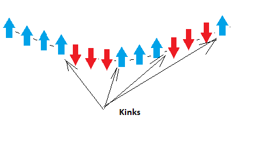
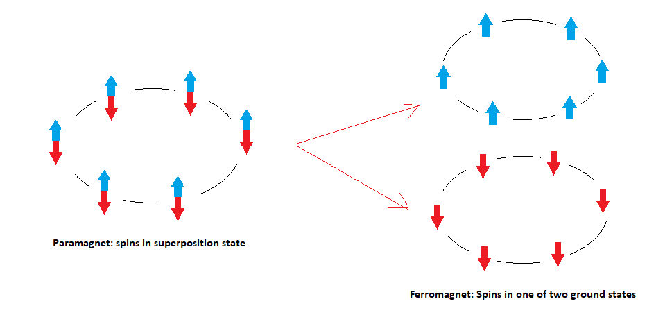
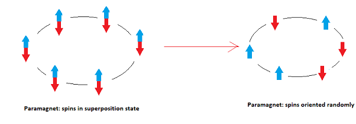
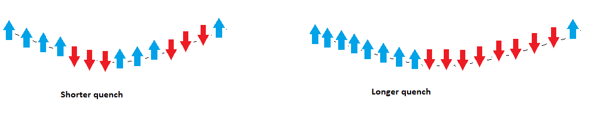

[](
  https://codespaces.new/dwave-examples/kibble-zurek-notebook?quickstart=1)

# Coherent Annealing: Kibble-Zurek Simulation on a QPU

A demonstration of using the 
[fast-anneal protocol](https://docs.dwavesys.com/docs/latest/c_qpu_annealing.html) 
on a quantum computer to simulate the formation of topological defects 
in a 1D ring of spins undergoing a phase transition, as described by the 
[Kibble-Zurek mechanism](https://en.wikipedia.org/wiki/Kibble%E2%80%93Zurek_mechanism).

This example employs quantum annealing in the coherent regime of a D-Wave
quantum processing unit (QPU), producing samples that align with the theoretical 
predictions.


* [The Kibble-Zurek Mechanism](#The-Kibble-Zurek-Mechanism)
* [Installation](#Installation)
* [Usage](#Usage)
* [Model Overview](#Model-Overview)
* [Code](#Code)
* [License](License)

## <a name="The-Kibble-Zurek-Mechanism"></a> The Kibble-Zurek Mechanism

The Kibble-Zurek mechanism relates, for a system driven through a 
[phase transition](#Phase-Transitions), the formation of 
[topological defects](#Topological-Defects) to the 
[transition rate](#Transition-Rate). This section provides an intuitive 
understanding of the highlighted terms. 

### <a name="Phase-Transitions"></a> Phase Transitions

Some macroscopic phase transitions are familiar: a changing temperature will 
transition water (a liquid) to ice (a solid); it can also change the magnetic 
properties of metal. 


In both cases, the material transitions between **disorderly** and **orderly** 
states: 

*   Orderly crystalline structure of ice versus the ongoing formation and 
    breaking of hydrogen bonds in water.
*   Aligned microscopic magnetic domains in a ferromagnet versus random 
    orientations in a nonmagnetic metal. 

### <a name="Topological-Defects"></a> Topological Defects

Kibble's original formulation explained the transition of the hot post-Big Bang 
universe from highly symmetric to its current state, with its non-uniform 
distribution of galaxies.  


Zurek expanded the idea to condensed matter and quantum phase transitions.   

A simple example of topological defects are kinks in a ring of 
ferromagnetically-coupled spins. A *quench* (a control parameter changing
at a high rate compared to system dynamics; with D-Wave's fast-anneal protocol, 
the anneal schedule can be fast compared to thermalization times) transitions 
the system from a state of spins in superposition to a state that has alternating 
segments of up/down spins. Switches from one segment to the next are called 
"kinks". 



### Transition Rate

For continuous or quantum phase transitions, the mechanism relates the density 
of defects/kinks to the quench time as a universal scaling law.

Consider two extreme cases:

1.  **Ideal adiabatic transition**. 

    At the end of a sufficiently slow anneal, the system ends in one of its two 
    ground states: all spins up or all spins down.




2.  **Instantaneous quench**.

    Each spin independently orients up or down (in an unbiased system, both 
    outcomes have equal probablility).



In between these two extremes, for fast quenches, the system ends in a state 
of alternating segments of up/down spins. The average length of these segments
increases with the quench/anneal time. For this example of a quantum phase 
transition (a 1D ring of spins), the Kibble-Zurek mechanism predicts that the 
average length increases as a function of the square root of the anneal time.



## <a name="Installation"></a> Installation

You can run this example without installation in cloud-based IDEs that support 
the [Development Containers specification](https://containers.dev/supporting)
(aka "devcontainers").

For development environments that do not support ``devcontainers``, install 
requirements:

    pip install -r requirements.txt

If you are cloning the repo to your local system, working in a 
[virtual environment](https://docs.python.org/3/library/venv.html) is 
recommended.

## <a name="Usage"></a> Usage

Your development environment should be configured to 
[access Leap’s Solvers](https://docs.ocean.dwavesys.com/en/stable/overview/sapi.html).
You can see information about supported IDEs and authorizing access to your 
Leap account [here](https://docs.dwavesys.com/docs/latest/doc_leap_dev_env.html).  

To run the demo:

```bash
python app.py
```

Access the user interface with your browser at http://127.0.0.1:8050/.

The demo program opens an interface where you can configure 
problems, submit these problems to a quantum computer, and compare the results
to the Kibble-Zurek predictions.

*Hover over an input field to see a description of the input and its range of*
*supported values.*

## <a name="Model-Overview"></a> Model Overview


Note that as you increase the anneal time, you move from the coherent regime 
and the returned samples are increasingly affected by thermalization, pushing 
the kink density away from the predicted value.  

## <a name="Code"></a> Code

Most the code related to configuring and analyzing the Ising problem is in the
[helpers/qa.py](helpers/qa.py) and [helpers/kz_calcs.py](helpers/kz_calcs.py) 
files. The remaining files mostly support the user interface.

---
**Note:** Standard practice for submitting problems to Leap solvers is to use
a [dwave-system](https://docs.ocean.dwavesys.com/en/stable/docs_system/sdk_index.html)
sampler; for example, you typically use
[DWaveSampler](https://docs.ocean.dwavesys.com/en/stable/docs_system/reference/samplers.html)
for Ising problems. The code in this example uses the
[dwave-cloud-client](https://docs.ocean.dwavesys.com/en/stable/docs_cloud/sdk_index.html),
which enables finer control over communications with the Solver API (SAPI).

If you are learning to submit problems to Leap solvers, use a ``dwave-system``
solver, with its higher level of abstraction and thus greater simplicity,
as demonstrated in most the code examples of the
[example collection](https://github.com/dwave-examples) and in the
[Ocean documentation](https://docs.ocean.dwavesys.com/en/stable/index.html).

---

## License

Released under the Apache License 2.0. See [LICENSE](LICENSE) file.
