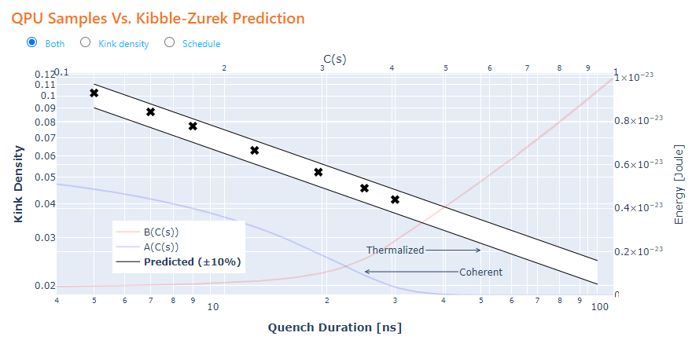
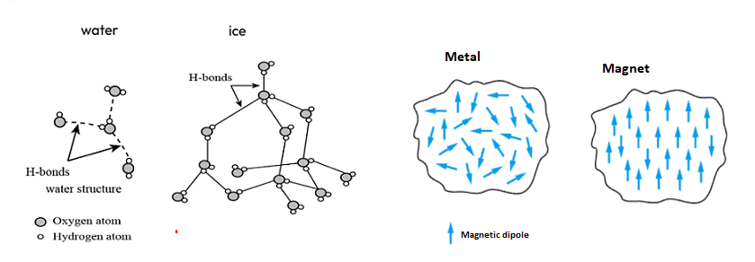
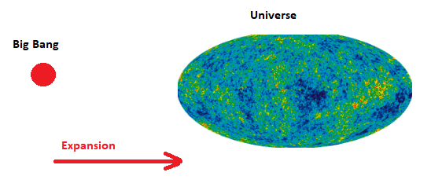
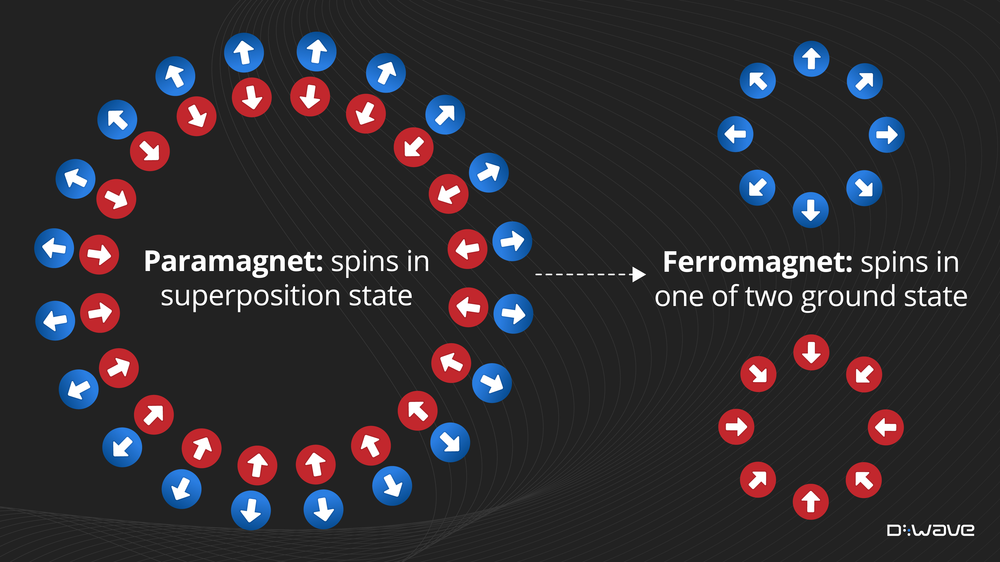
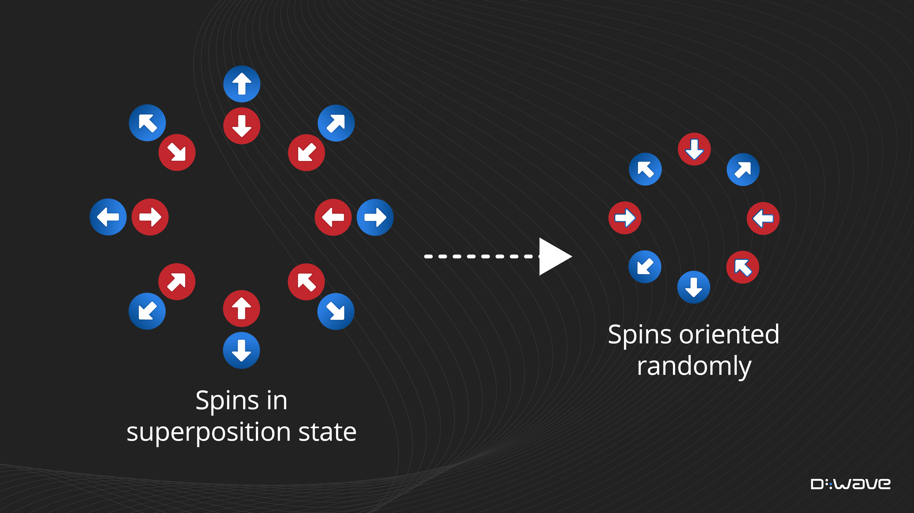
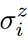
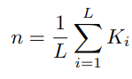

[](
  https://codespaces.new/dwave-examples/kibble-zurek-notebook?quickstart=1)

# Coherent Annealing: Kibble-Zurek Simulation on a QPU

A demonstration of using the 
[fast-anneal protocol](https://docs.dwavesys.com/docs/latest/c_qpu_annealing.html) 
on a quantum computer to simulate the formation of topological defects 
in a 1D ring of spins undergoing a phase transition, as described by the 
[Kibble-Zurek mechanism](https://en.wikipedia.org/wiki/Kibble%E2%80%93Zurek_mechanism).

This example employs quantum annealing in the coherent regime of a D-Wave
quantum processing unit (QPU), producing samples that align with the theoretical 
predictions.



* [The Kibble-Zurek Mechanism](#The-Kibble-Zurek-Mechanism)
* [Installation](#Installation)
* [Usage](#Usage)
* [Model Overview](#Model-Overview)
* [Code](#Code)
* [License](License)

## <a name="The-Kibble-Zurek-Mechanism"></a> The Kibble-Zurek Mechanism

The Kibble-Zurek mechanism relates, for a system driven through a 
[phase transition](#Phase-Transitions), the formation of 
[topological defects](#Topological-Defects) to the 
[transition rate](#Transition-Rate). This section provides an intuitive 
understanding of the mechanism. 

### <a name="Phase-Transitions"></a> Phase Transitions

Some macroscopic phase transitions are familiar: a changing temperature will 
transition water (a liquid) to ice (a solid); it can also change the magnetic 
properties of metal. 



In both cases, the material transitions between **disorderly** and **orderly** 
states: 

*   Orderly crystalline structure of ice versus the ongoing formation and 
    breaking of hydrogen bonds in water.
*   Aligned microscopic magnetic domains in a ferromagnet versus random 
    orientations in a nonmagnetic metal. 

### <a name="Topological-Defects"></a> Topological Defects

Kibble's original formulation explained the transition of the hot post-Big Bang 
universe from highly symmetric to its current state, with its non-uniform 
distribution of galaxies etc.  



Zurek expanded the idea to condensed matter and quantum phase transitions.   

A *quench* is when a control parameter changes at a high rate compared to system 
dynamics; with D-Wave's fast-anneal protocol, the anneal schedule can be fast 
compared to thermalization times. For the simple system of a ring of 
ferromagnetically coupled spins, quenching (fast annealing) causes a transition 
from a state of spins in superposition to a state that has alternating segments 
of up/down spins. Switches from one segment to the next are called "kinks" (an 
example of topological defects).  


### Transition Rate

For continuous or quantum phase transitions, the mechanism relates the density 
of defects (e.g. kinks) to the quench time as a universal scaling law.

Consider two extreme cases:

1.  **Ideal adiabatic transition**. 

    At the end of a sufficiently slow anneal, the system ends in one of its two 
    ground states: all spins up or all spins down.



2.  **Instantaneous quench**.

    Each spin independently orients up or down (in an unbiased system, both 
    outcomes have equal probablility).



In between these two extremes, for fast quenches, the system ends in a state 
of alternating segments of up/down spins. The average length of these segments
increases with the quench/anneal time. For this example of a quantum phase 
transition (a 1D ring of spins), the Kibble-Zurek mechanism predicts that the 
average length increases as a function of the square root of the anneal time.


## <a name="Installation"></a> Installation

You can run this example without installation in cloud-based IDEs that support 
the [Development Containers specification](https://containers.dev/supporting)
(aka "devcontainers").

For development environments that do not support ``devcontainers``, install 
requirements:

    pip install -r requirements.txt

If you are cloning the repo to your local system, working in a 
[virtual environment](https://docs.python.org/3/library/venv.html) is 
recommended.

## <a name="Usage"></a> Usage

Your development environment should be configured to 
[access Leap’s Solvers](https://docs.ocean.dwavesys.com/en/stable/overview/sapi.html).
You can see information about supported IDEs and authorizing access to your 
Leap account [here](https://docs.dwavesys.com/docs/latest/doc_leap_dev_env.html).  

To run the demo:

```bash
python app.py
```

Access the user interface with your browser at http://127.0.0.1:8050/.

The demo program opens an interface where you can configure 
problems, submit these problems to a quantum computer, and compare the results
to the Kibble-Zurek predictions.

*Hover over an input field to see a description of the input and its range of*
*supported values.*

## <a name="Model-Overview"></a> Model Overview

Quantum simulation is valuable for demonstrating and understanding the 
capabilities of quantum computers. For example, the simulation of nonequilibrium 
dynamics of a magnetic spin system quenched through a quantum phase transition 
requires classical resources that grow exponentially with system size 
(see [[2]](#2)). D-Wave's quantum computers can enable such research as 
described in [[1]](#1), which studied coherent evolution through a quantum 
phase transition for a 1D transverse-field Ising chain. It observed, for long 
chains, the quantum Kibble-Zurek mechanism with theoretically predicted kink 
statistics; in small chains, excitation statistics validate the picture of a 
[Landau-Zener transition](https://en.wikipedia.org/wiki/Landau%E2%80%93Zener_formula) 
at a minimum gap. In both cases, results were in quantitative agreement with 
analytical solutions to the closed-system quantum model.

Comparing the theoretically predicted kink density against such a simulation 
on the quantum computer is done as follows.   

To calculate kink density from samples returned from the quantum computer, 
define a *kink operator*,

,

where J is the coupling strength between qubits and 
 is the Pauli operator on the i-th 
qubit. Put simply, for any sample returned from the quantum computer, the 
operator gives 1 if there is a kink between qubits i and i+1 (i.e., if the 
pair of qubits at the end of the anneal have different values for negative J 
and identical values for positive J). If there is no kink between the pair, 
the operator gives 0.

Define a *kink-density operator* as,

,

where L is the length of the chain of spins (the number of qubits coupled 
together).

Average kink density is obtained by sampling many times (the code in this 
example sets ``num_reads=100``) and averaging.

The research described in [[1]](#1) performed a more sophisticated version 
of this experiment: it employed advanced calibration techniques not used here
and also varied the temperature. 

The plot below from the paper shows  data for weak coupling, J=0.12, and strong 
coupling, J=−1.4, for a range of temperatures and anneal times. For strong 
coupling and fast anneals, the kink density is unaffected by temperature and 
agrees quantitatively with closed-system coherent quantum theory, shown as dotted 
green lines.


Note that as you increase the anneal time, you move from the coherent regime 
and the returned samples are increasingly affected by thermalization, pushing 
the kink density away from the predicted value.  

## <a name="Code"></a> Code

Most the code related to configuring and analyzing the Ising problem is in the
[helpers/qa.py](helpers/qa.py) and [helpers/kz_calcs.py](helpers/kz_calcs.py) 
files. The remaining files mostly support the user interface.

The [helpers/qa.py](helpers/qa.py) file provides the following functions related 
to the use of the quantum computer:

*   ``create_bqm()`` generates a binary quadratic model (BQM) to represent the
    ring of spins with a given coupling strength. 

*   ``find_one_to_one_embedding()`` find a minor embedding for the problem with
    a single qubit representing each logical spin in the ring. The function makes 
    a few attempts to find such an embedding. This function is used only if no 
    valid cached minor-embedding is available for the quantum computer. 

*   Additional convenience functions.

The [helpers/kz_calcs.py](helpers/kz_calcs.py) file provides the following 
functions related to Kibble-Zurek calculations:

*   ``theoretical_kink_density()`` calculates the kink density predicted for 
    the configured coupling strength and annealing time.

*   ``kink_stats()`` calculates the kink density for the sample set returned 
    from the quantum computer.

You can find more information in the documentation and comments in those files. 

Article [[2]](#2) predicts a characteristic energy scale that is 20% smaller 
than that of the 
[published annealing schedule](https://docs.dwavesys.com/docs/latest/doc_physical_properties.html) 
for quantum computer ``Advantage_system4.1`` used by the Kibble-Zurek calculation
in the ``theoretical_kink_density()`` function. A comparable discrepancy between 
the published and spectral-fit schedule is found in [[1]](#1) (see section 
"Extracting annealing schedules" in the supplementary material) for frustrated 
rings of various length and energy scales. The code in the 
``theoretical_kink_density()`` function applies this correction of 0.80 
to the published schedules.

---
**Note:** Standard practice for submitting problems to Leap solvers is to use
a [dwave-system](https://docs.ocean.dwavesys.com/en/stable/docs_system/sdk_index.html)
sampler; for example, you typically use
[DWaveSampler](https://docs.ocean.dwavesys.com/en/stable/docs_system/reference/samplers.html)
for Ising problems. The code in this example uses the
[dwave-cloud-client](https://docs.ocean.dwavesys.com/en/stable/docs_cloud/sdk_index.html),
which enables finer control over communications with the Solver API (SAPI).

If you are learning to submit problems to Leap solvers, use a ``dwave-system``
solver, with its higher level of abstraction and thus greater simplicity,
as demonstrated in most the code examples of the
[example collection](https://github.com/dwave-examples) and in the
[Ocean documentation](https://docs.ocean.dwavesys.com/en/stable/index.html).

---

## References

<a name="1">[1]</a> King, A.D., Suzuki, S., Raymond, J. et al. 
Coherent quantum annealing in a programmable 2,000 qubit Ising chain. 
Nat. Phys. 18, 1324–1328 (2022). https://doi.org/10.1038/s41567-022-01741-6

<a name="2">[2]</a> King, A.D. et al.
Computational supremacy in quantum simulation.
https://arxiv.org/abs/2403.00910

## License

Released under the Apache License 2.0. See [LICENSE](LICENSE) file.
