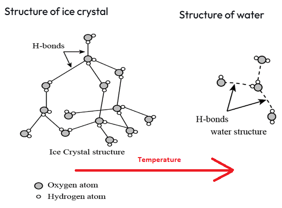
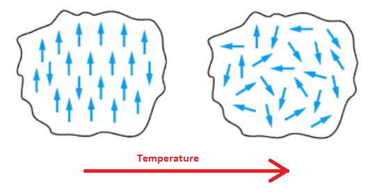

[](
  https://codespaces.new/dwave-examples/kibble-zurek-notebook?quickstart=1)

# Coherent Annealing: Kibble-Zurek Simulation on a QPU

A demonstration of using the 
[fast-anneal protocol](https://docs.dwavesys.com/docs/latest/c_qpu_annealing.html) 
on a quantum processing unit (QPU) to simulate the formation of topological defects 
in a 1D ring of spins undergoing a phase transition, as described by the 
[Kibble-Zurek mechanism](https://en.wikipedia.org/wiki/Kibble%E2%80%93Zurek_mechanism).

This example anneals an Ising problem in the coherent regime, producing results 
predicted for your configured anneal duration.


* [The Kibble-Zurek Mechanism](#The-Kibble-Zurek-Mechanism)
* [Installation](#Installation)
* [Usage](#Usage)
* [Model Overview](#Model-Overview)
* [Code](#Code)
* [License](License)

## <a name="The-Kibble-Zurek-Mechanism"></a> The Kibble-Zurek Mechanism

Some macroscopic phase transitions are familiar: raise the surrounding 
temperature and solid ice transitions to liquid water, magnets become 
demagnetized. The material switches from an orderly state to a disorderly 
one. In the former magnet, once-aligned microscopic magnetic domains acquire 
random orientations; the crystalline structure of ice atoms gives way to  
an ongoing formation and breaking of hydrogen bonds in water. 





The Kibble-Zurek mechanism relates the formation of topological defects in 
a system driven through a phase transition to the (finite) rate of that 
transition. 

Kibble originally formulated the mechanism to explain the transition of the 
hot post-Big Bang universe from highly symmetric to the current cool and 
expanding state, with its galaxies of stars and planets.  


Zurek expanded the idea to condensed matter. It pertains also to quantum phase 
transitions. The Kibble-Zurek mechanism relates the density of topological 
defects from continuous or quantum phase transitions to the quench time as 
a universal scaling law.  

For the relatively simple quantum phase transitions, a 
one-dimensional transverse-field Ising model (TFIM), 

FORMULA OF ISING MODEL WITH J=-1, 

consider two extreme cases:

1. The system undergoes an ideal adiabatic quench. 


At the end of a very long anneal, it ends in one of two ground states:
all spins up or all spins down.

2. The system undergoes an instantaneous quench.


Each spin is independently oriented up or down.

In between these two extremes, for finite quenches, the system ends in a state 
of alternating groups of spins, some up and some down. The length of these
groups increases with the quench time. (For the case of a 1D TFIM, it increases 
as a function of the square root of the anneal time.)


For a particular topology, such as the 1D chain of spins, you can predict 
the average length of these groups, which is equivalent to the density of 
switches from one group to the next ("kinks"). 


## <a name="Installation"></a> Installation

You can run this example without installation in cloud-based IDEs that support 
the [Development Containers specification](https://containers.dev/supporting)
(aka "devcontainers").

For development environments that do not support ``devcontainers``, install 
requirements:

    pip install -r requirements.txt

If you are cloning the repo to your local system, working in a 
[virtual environment](https://docs.python.org/3/library/venv.html) is 
recommended.

## <a name="Usage"></a> Usage

Your development environment should be configured to 
[access Leap’s Solvers](https://docs.ocean.dwavesys.com/en/stable/overview/sapi.html).
You can see information about supported IDEs and authorizing access to your 
Leap account [here](https://docs.dwavesys.com/docs/latest/doc_leap_dev_env.html).  

To run the demo:

```bash
python app.py
```

Access the user interface with your browser at http://127.0.0.1:8050/.

The demo program opens an interface where you can configure 
problems, submit these problems to a quantum computer, and compare the results
to the Kibble-Zurek predictions.

*Hover over an input field to see a description of the input and its range of*
*supported values.*

## <a name="Model-Overview"></a> Model Overview

TBD

## <a name="Code"></a> Code

Most the code related to configuring and analyzing the Ising problem is in the
[helpers/qa.py](helpers/qa.py) and [helpers/kz_calcs.py](helpers/kz_calcs.py) 
files. The remaining files mostly support the user interface.

---
**Note:** Standard practice for submitting problems to Leap solvers is to use
a [dwave-system](https://docs.ocean.dwavesys.com/en/stable/docs_system/sdk_index.html)
sampler; for example, you typically use
[DWaveSampler](https://docs.ocean.dwavesys.com/en/stable/docs_system/reference/samplers.html)
for Ising problems. The code in this example uses the
[dwave-cloud-client](https://docs.ocean.dwavesys.com/en/stable/docs_cloud/sdk_index.html),
which enables finer control over communications with the Solver API (SAPI).

If you are learning to submit problems to Leap solvers, use a ``dwave-system``
solver, with its higher level of abstraction and thus greater simplicity,
as demonstrated in most the code examples of the
[example collection](https://github.com/dwave-examples) and in the
[Ocean documentation](https://docs.ocean.dwavesys.com/en/stable/index.html).

---

## License

Released under the Apache License 2.0. See [LICENSE](LICENSE) file.
